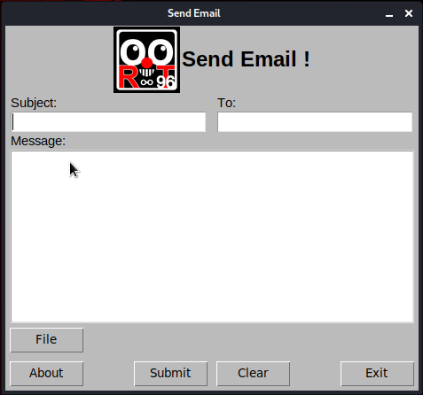

# Send_Email
'Send_Email' for send email from Gmail OR an other mail server.

<div align="center">
    <!--a href="" target="_blank"-->
        
    <!--/a-->
</div>


### Languages :
* python

### System :
* Linux
* windows

# Requirements
[✓] smtplib
[✓] email
[✓] tkinter
[✓] sys


# How to get this tool
```
git clone https://github.com/byRo0t96/Send_Email.git
cd Send_Email
```


# For install tkinter in Linux
```
bash requirements.sh
```

# How to run after download
for send Email from gmail server (default smtp.gmail.com:587):
```
python start.py Email Password
```
OR use this command for send Email from another mail server
```
python start.py Email Password Mailserver:Port
```


# SUPPORTED DISTRIBUTIONS
|Distribution | Version Check | supported | status |
----------|-------|------|-------|
|Kali Linux|2020.1 | yes | working   |
|windows|10 | yes | working   |


## Release History
```
[◉] Version 0.0.1 [11-04-2020]
...
```


### Contact :
##### Mail : by.root96@gmail.com

## License
Copyright (C) 2010 - 2020 [byRo0t96](https://byro0t96.github.io/)

